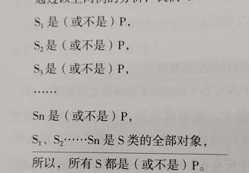
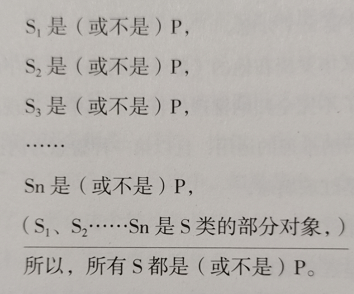
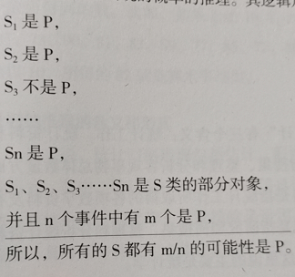

# 神逻辑——恶补逻辑学的第一本书

## 第三章 判断思维
你认为正确的不一定是正确的

### 什么是判断

### 判断与语句

### 结构歧义

#### 什么是结构歧义？

#### 结构歧义的类型
1. 结构层次不同引起的歧义
	可以用层次分析法：
	- 如：关心企业的员工
	
2. 结构关系不同引起的歧义

   如主谓关系，动宾关系等；

   - 如：进口汽车，学习文件

3. 语义关系不同引起的歧义

   施事和受事之间的关系

   - 通知的人
   - 巴金的书

### 直言判断

分类：

1. 根据模态词（必然，可能等）

   - 模态判断：断定事物的可能性和必然性的判断

   - 非模态判断

     - 简单判断

       - 直言判断：直接断定思维对象具有或者不具有某种性质；也叫性质判断。

         直言判断由逻辑变项（主项，谓项）和逻辑常项（联项，量项）组成

       - 关系判断

     - 复合判断

       - 联言判断
       - 选言判断
       - 假言判断
       - 负判断

2. 主项：被断定的对象，S

   任何直言判断都有主项，或者在上下文中；

3. 谓项：反映被断定的对象属性的概念，P（S是P）；

   有可能在上下文中；

4. 联项：“是”、“不是”

   可能省略；

5. 量项：表示主项的数量或者范围的概念；

### 关系判断

关系判断的含义：断定思维对象之间是否具有某种关系；

### 联言判断

含义：由联结词连接的两个或者两个以上的简单判断有机组合成的；

肢判断：其中的简单判断；

联言判断是断定几种对象或事物情况同时存在的复合判断。

联言判断的结构：

1. 联言肢：联言判断里面的各个简单判断；

2. 联言联结词

   - 虽然但是

   - 不但而且

   - ###### ……

3. 联言判断的逻辑形式

   p并且q

### 充分条件假言判断

假言判断：断定某个情况的存在是另一种情况的条件

- 如果你病了，你会不舒服
  - 不病也可能会不舒服；

充分条件假言判断：某一事件情况是另一事物情况存在的充分条件；

### 必要条件假言判断

必要条件假言判断：某一事件情况是另一事物情况存在的必要条件；

- 只有体检合格，才能参加考试；
  - 不合格不能参加考试；
- 常用
  - 没有……就没有……
  - 必须……才……

### 充分必要条件假言判断

充分必要条件假言判断：某一事件情况是另一事物情况存在的充分必要条件；

- 当且仅当……

## 第四章 演绎推理思维

找出问题，分析问题

### 4.1 什么是推理

#### 推理的含义

- 在逻辑学中，推理就是由一个或者几个已知判断推出新的判断的一种思维形式。
	- 推理的依据：
		- 现有的知识或者已知判断
	- 得出的结论：
		- 新的结论

### 4.2 推理的种类

#### 推理的种类

1. 直接推理和间接推理

   直接推理：由一个判断得出结论

   间接推理：两个或者两个以上的判断得出结论
   
2. 简单判断推理和符合判断推理

   简单判断推理：简单判断为前提

   复合判断推理：

3. 演绎、归纳、类比

   演绎推理：从一般性、普遍性认识推出个别性、特殊性认识的推理

   归纳推理：从个别性、特殊性认识推出一般性、普遍性认识的推理

   类比推理：从个别性、特殊性认识推出其他的个别性、特殊性认识，或者从一般性、普遍性认识推出一般性、普遍性认识的推理

4. 必然性、或然性

   必然性推理：推理的前提中蕴含结论的推理

   或然性推理：前提不蕴含结论的推理

5. 模态、非模态

   模态推理：包含模态判断

   非模态推理：不包含模态判断

**有效推理的条件**

- 形势正确
  - 外在形式
  - 逻辑规律和规则
- 推理的前提必须真实
  - 推理时所依据的各个判断必须真实、客观地反应客观存在，而不能任意凭主观臆造

==只有满足这俩条件的推理才是有效的==

### 4.3 三段论

#### 三段论的定义

以包括一个共同概念的两个直言判断作为前提退出一个新的直言判断作为结论的演绎推理形式。

#### 三段论的结构

大项(P)、小项(S)和中项(M)

S 是 M，M是P --->S是P

包含P：大前提

包含S：小前提

#### 三段论的特点

1. 都是由两个已知直言判断作为前提推出一个新的直言判断
2. 两个前提中都必然包含一个共同概念（中项）
3. 是必然性推理
4. 是演绎推理

#### 三段论的公理

1. 对一类事物的全部有所肯定，就是对该类事物的部分也有所肯定。
2. 对一类事物的全部有所否定，就是对该类事物的部分也有所否定。

### 4.4 三段论的规则

**规则一：有且只有大项、中项和小项这三个不同的项**

- 四概念错误

  （1）由完全不同的四个词项组成的三段论

  （2）前提中使用外延不同的词项作为中项

**规则二：中项在前提中至少要周延一次**

周延的：指一个判断的主词或宾词所包括的是其全部外延。

- 周延性问题：

  在直言判断中，对主项和谓项的外延范围或数量做断定的问题。

- 错误示例：

  外语系学生都是学外语的，小名是学外语的，所以小名是外语系学生

**规则三：前提中不周延的项在结论中亦不得周延**

1. 大项在前提中不周延在结论中周延
2.  小项在前提中不周延在结论中周延

**规则四：大小前提不能都是否定判断**

猫不是豹子，豹子不是老虎，猫可以是老虎也可以不是老虎

**规则五：结论为否定，前提必有一个是否定，反之亦然**

**规则六：大小前提不能都是特称判断**

**规则七：若前提有一个是特称，结论必然也是特称的**

### 4.5 猜测与演绎推理

## 第五章 归纳逻辑思维

由特殊到普遍的推理

### 5.1 什么是归纳推理

**归纳推理的含义：**个别性认识推出一般性认识

**归纳推理的种类：**

- 完全归纳推理
- 不完全归纳推理
  - 简单枚举……
  - 科学……

**归纳推理的特点：**

1. 个别性推出普遍性认识；
2. 除了完全归纳推理，前提不蕴含结论，结论断定的范围>前提断定的范围
3. 除了完全归纳推理，结论不是必然的

### 5.2 完全归纳推理

**完全归纳推理的含义：**根据某类事物**每一个对象**都具有或不具有某种属性，推出该类事物全都具有或不具有某种属性。

**完全归纳推理的形式和规则：**

- 规则：
  - 对这类事物的任何个体对象的断定，不能遗漏
  - 推理前提的每个判断必须全部都是事实
  - 考察的事物对象数量应该是有限的，并且有可能对其一一考察
  - 所有判断的谓项必须是同一概念，联项必须完全相同

### 5.3 不完全归纳推理

**不完全归纳推理的含义和形式**

- 根据某类事物的部分对象都具有或不具有某些属性，推出该类事物全都……

- 形式：

  

**不完全归纳推理的种类**

1. 简单枚举归纳推理

2. 科学归纳推理

   根据某类事物的部分对象与某属性之间的必然联系，在科学分析的基础上推出该类事物全都具有或者不具有该属性。

### 5.4 类比推理

**含义：**根据两个或两类事物在某些属性上相同或相似，推出它们在另外的属性上也相同

**形式：**A has a,b,c; B has a,b ---> B has c

**类比推理的种类**

- 正类比

  A has a, b, c ; B has a, b; ---> B has c ;

- 反类比

  A does not have d, e, f; B does not have d,e; --->B does not has f

- 合类比

  正类比和反类比整合

- 模拟类比

  A has a,b,c & A relate to R; B is designed to has a,b,c so B relate to R;

### 5.5 概率归纳推理

**概率的定义：**

- 古典定义：
- 统计定义：

**含义与特征：**

- 由某一事件中的个别对象出现的概率推出该对象事件中全部对象出现的概率

- 表现：

  

- 特征：
  1. 由个别-->一般，特殊到普通
  2. 是或然性推理
  3. 前提全是真的，也不能推出必然真的结论
  4. 即使出现反例，也不影响人们对考察对象的大致理解。

### 5.6 统计归纳推理

**统计学：**

**统计三个含义：**统计工作，统计资料，统计学

总体、个体、样本、抽样

**含义和形式：**

- 由样本具有某种属性推理出总体也具有某种属性
- 形式：
  - 估计
  - 假设检验
  - 贝叶斯推理

## 第六章 科学逻辑方法

### 6.1 什么是科学逻辑方法

**逻辑方法：**人的大脑对事物外部联系进行处理，逐渐把握事物本质和规律，形成概念，判断，进行推理

**科学方法：**认识和实践活动中运用的正确方法……

**科学逻辑方法：**上面二者的综合运用

### 6.2 什么是因果联系

### 6.3 求同法

### 6.4 求异法

### 6.5 求同求异并用法

## 第七章 逻辑基本规律

### 7.1 逻辑的基本规律

### 7.2 同一律

### 7.3 矛盾律

### 7.4 逻辑矛盾与辩证矛盾

### 7.5 悖论

### 7.6 排中律

### 7.7 充足理由律

## 第八章 逻辑论证思维

### 8.1 什么是逻辑论证

### 8.2 论证的结构

### 8.3 证明的方法

### 8.4 反驳的方法

### 8.5 论证的规则

## 第九章 逻辑谬误

### 9.1 什么是逻辑谬误

### 9.2 谬误的种类

### 9.3 构型歧义和语音歧义

### 9.4 混淆概念和偷换概念

### 9.5 断章取义

### 9.6 诉诸权威、怜悯、威力、众人

### 9.7 以感觉经验为据

### 9.8 错误引用

### 9.9 重复谎言
